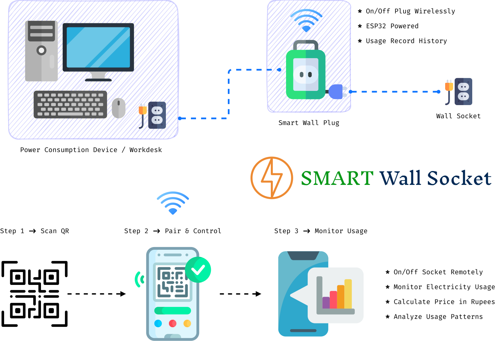

<p align="center">
  
</p>

<h1 align="center">Smart Wall Socket</h1>

<p align="center">
  <b>Real-time energy monitoring for your home - powered by ESP32 & Android</b>
</p>

<p align="center">
  <a href="https://github.com/Danushka-Madushan/smart-wall-socket/releases"></a>
  <a href="https://github.com/Danushka-Madushan/smart-wall-socket/actions"></a>
  
  
</p>

---

## 📖 Overview

**Smart Wall Socket** is an IoT-based energy monitoring system that transforms a standard wall socket into an intelligent power outlet. It measures real-time current draw using a **CT sensor (SCT-013)** connected to an **ESP32** microcontroller and streams the data over Wi-Fi to a companion **Android app (SocketMan)** built with Jetpack Compose.

The system enables users to:

- ⚡ Monitor **real-time power consumption** (watts, amps, voltage)
- 📊 Track **cumulative energy usage** in kWh units
- 💰 View **estimated electricity costs** based on Sri Lankan tiered tariff rates
- 🔍 **Auto-discover** smart sockets on the local network via mDNS
- 📱 Connect to devices seamlessly from the Android app

---

## 🏗️ Architecture

<p align="center">
  
</p>

The system consists of two main components:

| Component    | Technology                        | Description                                |
| ------------ | --------------------------------- | ------------------------------------------ |
| **Firmware** | ESP32 + Arduino + PlatformIO | Reads CT sensor data, hosts a REST API     |
| **Client**   | Android (Kotlin + Jetpack Compose)       | Discovers devices, displays energy metrics |

**Communication**: The Android app communicates with the ESP32 over **HTTP REST** on the local Wi-Fi network. Device discovery uses **mDNS** (`smartsocket.local`).

---

## 📂 Project Structure

```
smart-wall-socket/
├── client/                     # Android app (SocketMan)
│   ├── app/
│   │   └── src/main/java/nibm/iot/socketman/
│   │       ├── MainActivity.kt
│   │       ├── viewmodel/
│   │       │   └── SocketViewModel.kt
│   │       └── ui/
│   │           ├── screens/Screens.kt
│   │           └── theme/
│   ├── build.gradle.kts
│   └── settings.gradle.kts
├── firmware/                   # ESP32 firmware
│   ├── src/
│   │   └── main.cpp
│   └── platformio.ini
├── docs/                       # Documentation & diagrams
│   ├── icon.svg
│   ├── block_diagram.svg
│   ├── circuit_image.svg
│   └── system_design.svg
└── .github/workflows/         # CI/CD
    └── build-apk.yml
```

---

## ⚙️ Firmware

### Hardware Requirements

| Component              | Specification                    |
| ---------------------- | -------------------------------- |
| Microcontroller        | ESP32 |
| Current Sensor         | SCT-013-030 (30A / 1V)          |
| Mains Voltage          | 230V AC / 50Hz (Sri Lanka)       |
| Development Framework  | Arduino (via PlatformIO)         |

### Dependencies

| Library                                   | Version | Purpose                            |
| ----------------------------------------- | ------- | ---------------------------------- |
| `openenergymonitor/EmonLib`               | ^1.1.0  | AC current measurement (Irms)      |
| `bblanchon/ArduinoJson`                   | ^7.0.0  | JSON serialization for API responses |

### Firmware Setup

1. Install [PlatformIO](https://platformio.org/install)
2. Open the `firmware/` directory in PlatformIO
3. Update Wi-Fi credentials in `main.cpp`:
   ```cpp
   const char *WIFI_SSID = "your-wifi-ssid";
   const char *WIFI_PASS = "your-wifi-password";
   ```
4. Connect the ESP32 via USB and flash:
   ```bash
   cd firmware
   pio run --target upload
   ```
5. Monitor serial output:
   ```bash
   pio device monitor --baud 115200
   ```

### REST API

Once running, the ESP32 exposes the following endpoints at `http://smartsocket.local` (or its IP address):

#### `GET /api/heartbeat`

Health check endpoint.

```json
{ "ack": true }
```

#### `GET /api/wifi/status`

Returns the device's current Wi-Fi connection details.

```json
{
  "connected": true,
  "ssid": "MyNetwork",
  "ip": "192.168.1.42",
  "mac": "DE:AD:BE:EF:01:01",
  "rssi": -45
}
```

#### `GET /api/energy`

Returns the latest energy readings.

```json
{
  "current_A": 0.52,
  "power_W": 119.6,
  "voltage_V": 230.0
}
```

---

## 📱 Android App (SocketMan)

### Tech Stack

| Technology             | Details                          |
| ---------------------- | -------------------------------- |
| Language               | Kotlin                           |
| UI Framework           | Jetpack Compose + Material 3     |
| Architecture           | MVVM (ViewModel)                 |
| Min SDK                | 29 (Android 10)                  |
| Target SDK             | 37                               |
| Device Discovery       | Android NSD (mDNS/DNS-SD)        |

### Features

- **Auto-Discovery** - Scans the local network for smart sockets using mDNS service discovery (`_http._tcp.`), with a fallback probe to `192.168.4.1` (ESP32 AP mode)
- **Real-Time Dashboard** - Large power readout (watts) with voltage and current cards, updated every second
- **Energy Tracking** - Accumulates total kWh units consumed during the session
- **Cost Estimation** - Calculates estimated electricity bill using Sri Lanka's CEB tiered pricing:

  | Tier         | Rate (LKR/unit) |
  | ------------ | --------------- |
  | 0 – 60       | 14.00           |
  | 61 – 90      | 20.00           |
  | 91 – 120     | 28.00           |
  | 121 – 179    | 44.00           |
  | 180 (flat)   | 32.50           |
  | Above 180    | 100.00          |

### Building the App

**Prerequisites**: JDK 21, Android SDK

```bash
cd client
./gradlew assembleRelease
```

The APK will be at `client/app/build/outputs/apk/release/`.

---

## 🚀 CI/CD

The project uses **GitHub Actions** to automatically build and release the APK when a version tag is pushed:

```bash
git tag v1.0.0
git push origin v1.0.0
```

This triggers the [Build & Release APK](.github/workflows/build-apk.yml) workflow which:
1. Builds a release APK using JDK 21
2. Creates a GitHub Release with auto-generated release notes
3. Attaches the APK as a downloadable asset

---

## 📄 Documentation

Detailed project documentation is available in the [`docs/`](docs/) directory:

| Document                         | Description                        |
| -------------------------------- | ---------------------------------- |
| [Project Proposal](docs/IoT%20-%20Project%20Proposal%20-%20Full.pdf) | Full project proposal              |
| [System Design](docs/IoT%20-%20System%20Design.pdf)                  | System architecture & design       |
| [Circuit Design](docs/IoT%20-%20Curcuit%20Design.pdf)                | Hardware circuit schematics        |
| [Presentation](docs/IoT%20SMART%20Wall%20Socket.pdf)                 | Project presentation slides        |

---

## 🛠️ System Design

<p align="center">
  
</p>

---

## 📝 License

This project is open source and available under the [MIT License](LICENSE).
